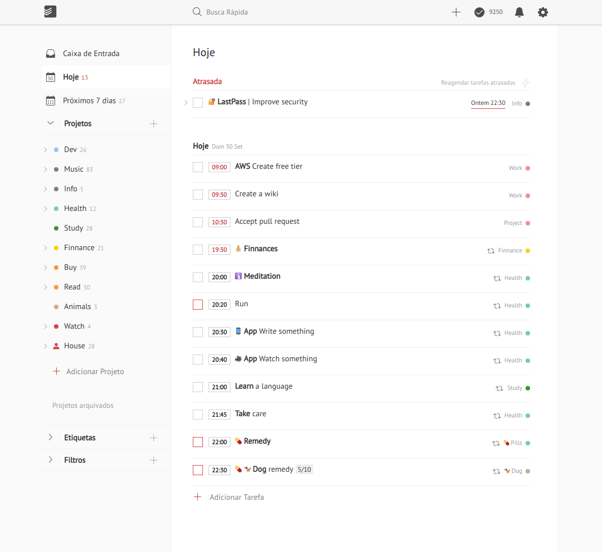

<h1 align="center">
  <br>
  <br>
  Better Todoist
</h1>

<p align="center">
  Improvements for Todoist<br>
  <a href="https://raw.githubusercontent.com/thiagobraga/todoist-userstyles/master/theme.user.css"></a>
  <a href="https://raw.githubusercontent.com/thiagobraga/todoist-userstyles/master/theme.user.css"></a>
  <a href="https://www.paypal.com/cgi-bin/webscr?cmd=_donations&business=thibraga06%40gmail.com&item_name=Contribuir+para+o+desenvolvimento+de+projetos+open+source&currency_code=BRL&source=url" target="_blank" rel="nofollow noopener"></a>
</p>

## Contents

✔ Squared tasks checkbox  
✔ Emphasis on the task time  
✔ Smaller project circles and emojis  
✔ Using PT Sans from Google Fonts  

## Installation

1. Install [Stylus](https://add0n.com/stylus.html)
2. Then <a href="https://raw.githubusercontent.com/thiagobraga/gmail-userstyles/master/theme.user.css"></a>

## Development

``` sh
git clone https://github.com/thiagobraga/todoist-userstyles
cd todoist-userstyles
make
```

## Screenshots

<h3 align="center">Dark theme</h3>

<p align="center">
  
</p>

<h3 align="center">Neutral theme</h3>

<p align="center">
  
</p>
